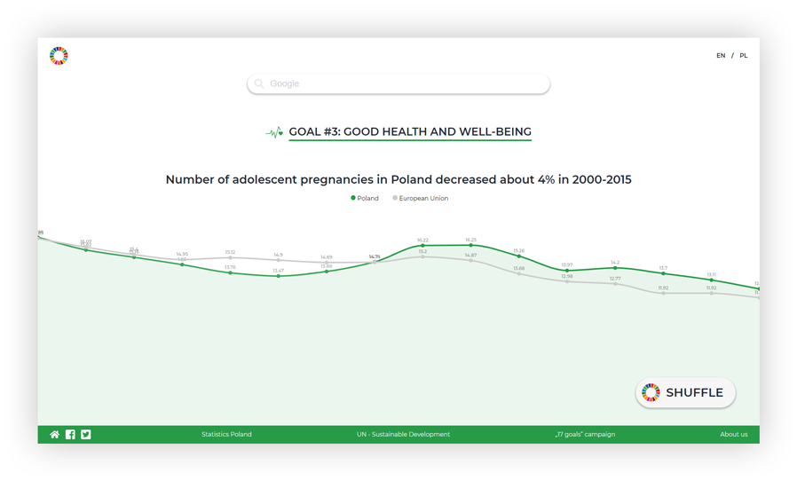

# Shuffle

  

Shuffle is a hackathon project promoting United Nation's Sustainable Development Goals. We noticed youth is not interested in statistical data. Also, many people are put off by top-down approach: they think the international agenda does not apply to them, when it's quite the contrary.

Our idea is a start page for computers in institutions, school libraries etc. It generates human-readable sentences from UN data and presents them along with a chart. Data for Poland is accompanied with EU average computed from data for other countries.

## Technologies

To remove the burden of installation and maintenance, whole app is a static JavaScript client written with Vue.js. We used Chartist.js for chart generation. All data is fetched and analyzed on client side, then saved to browser local storage.

Repository also contains manifest file to create a Chrome extension overriding new tab page.

## Licensing

Copyright © 2018 Krzysztof Antoniak, Łukasz Kędziorski, Marta Mazurkiewicz.

Contents of this repository is licensed under GNU General Public License, version 3.0 (GPL-3.0).

### Used libraries

* [Vue.js](https://vuejs.org/) under MIT license
* [vue-router](https://github.com/vuejs/vue-router/) under MIT license
* [vue-i18n](https://github.com/kazupon/vue-i18n) under MIT license
* [vue-chartist](https://github.com/Yopadd/vue-chartist) under WTFPL license
* [chartist-plugin-pointlabels](https://github.com/gionkunz/chartist-plugin-pointlabels) under WTFPL license
* [axios](https://github.com/axios/axios) under MIT license
* [TweenMax](https://github.com/TypeCtrl/tinycolor) under their ["Standard license"](https://greensock.com/standard-license)
* [tinycolor](https://github.com/TypeCtrl/tinycolor) under MIT license